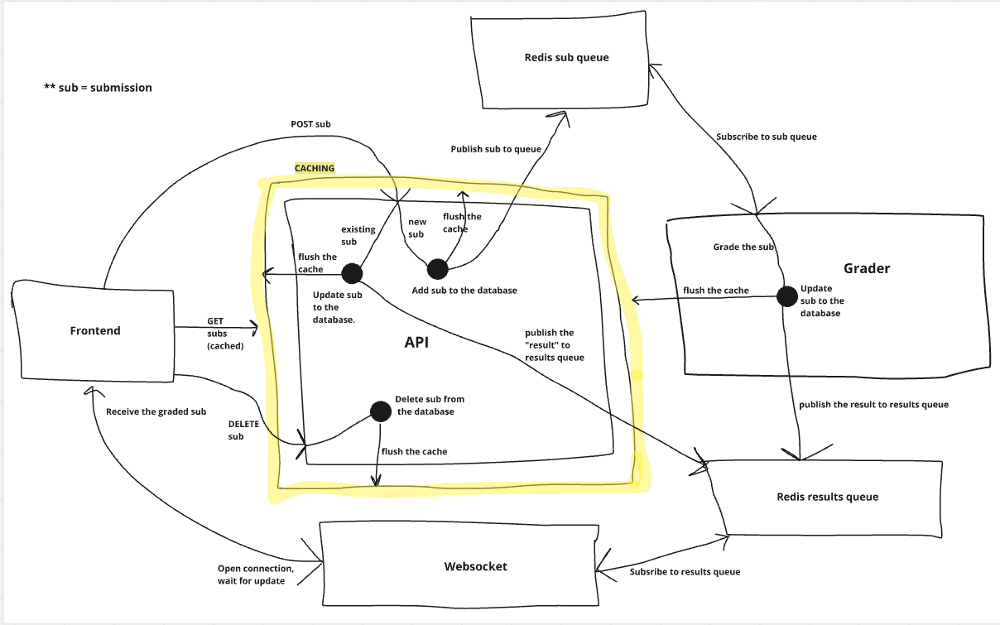

## General Overview

This is a project for a web application for practicing programming. The core functionality of the application is as follows:

- **User Interface:** Upon opening the application, the user is presented with the name and handout of a programming assignment. The interface includes a textarea for writing a Python program to solve the problem outlined in the handout and a submit button for assessment.
- **Assessment and Feedback:** After submission, the program is assessed, and the user receives updates on the grading status. If issues are found, they are displayed, allowing the user to adjust their code. If the program is correct, the user is notified of successful completion and can progress to the next assignment.
- **Progress Tracking:** When the user reopens the application, they can continue from the first incomplete assignment.

The focus of the project is on scalability, with an emphasis on topics such as performance measurement, multiple servers with load balancing, caching, static site generation, event-driven architecture, and message queues. Both development and production configurations are addressed.

<br>

## Architecture Overview

This application handles submissions and uses a message queue architecture with Redis for processing and caching. Below is an explanation of the key components and data flow based on the architecture diagram.



#### Components and Data Flow

1. **Frontend:**
   - **POST Request:** Sends a new submission (sub) to the API. 
   - **GET Request:** Retrieves cached submissions from the API.
   - **Receive Graded Sub:** The frontend receives graded results once submissions are processed.
   - **DELETE Request:** Removes a submission by sending a DELETE request via the API.
   - **WebSocket Connection:** Opens a persistent connection to receive real-time updates on submission status.

2. **API:**
   - **Submission Handling:** Receives new or updated submissions from the frontend.
   - **Caching:** Submissions are cached to improve performance. Cache is flushed when submissions are added, updated, or deleted.
   - **Database Operations:** 
     - **Add/Update Subs:** Adds new submissions or updates existing ones in the database.
     - **Delete Subs:** Deletes submissions from the database, triggering cache flush.
   - **Queue Operations:** 
     - Publishes new/updated submissions to the Redis submission queue.
     - Publishes graded results to the Redis results queue after processing.

3. **Redis Sub Queue:**
   - Buffers new or updated submissions.
   - The **Grader** subscribes to this queue to process each submission.

4. **Grader:**
   - **Grade Submission:** Subscribes to the Redis submission queue, processes submissions (grades), and updates the submission status in the database.
   - **Cache Management:** Flushes the cache after grading to maintain data consistency.
   - **Result Publishing:** Publishes the grading result to the Redis results queue.

5. **Redis Results Queue:**
   - Stores graded results from the Grader.
   - The API and WebSocket systems subscribe to this queue to retrieve results and send them to the frontend.

6. **WebSocket:**
   - Subscribes to the Redis results queue to receive graded submissions.
   - Sends real-time updates to the frontend when grading is complete.

#### Caching Flow
- Caching is implemented to improve performance by storing submissions temporarily. 
- The cache is flushed whenever submissions are added, updated, or deleted to ensure the frontend receives the most up-to-date data.

#### Data Flow Summary
1. A new submission is sent from the frontend to the API.
2. The API stores the submission in the database and publishes it to the Redis submission queue, flushing the cache.
3. The Grader processes the submission, grades it, and updates the database.
4. The grading result is published to the Redis results queue.
5. The API and WebSocket subscribe to the results queue and send the graded submission back to the frontend.

#### Key Design Concepts
- **Message Queuing:** Redis is used for message queuing, allowing asynchronous processing of submissions and results.
- **Real-Time Updates:** WebSockets ensure the frontend receives real-time updates about submission status.
- **Caching:** Caching is employed to boost performance, with cache invalidation ensuring data consistency when the state of submissions changes.

<br>

## Testing Instructions

If you're using VS Code, follow these steps to set up and run Playwright tests:

1. Install the **Playwright** extension from the VS Code Extensions Marketplace.
2. Once installed, open the Command Palette and type: `Install Playwright`.
3. After installation, you can run the Playwright tests using the VS Code extension by navigating to the **Tests** section in the left toolbar.

Alternatively, you can run the tests from the project root directory with the following command:

```bash
docker compose run --rm --entrypoint=npx e2e-playwright playwright test
```

Note: One of the tests may occasionally fail when run from the command line, but it consistently passes when executed via the VS Code Test Explorer.

<br>

## Running Instructions for Development Environment

1. Navigate to the `grader-image` directory and build the Docker image:

```bash
docker build -t grader-image .
```
<br>

2. From the root directory of the project, start the services:

```bash
docker compose up --build
```

Subsequent runs can be executed with:

```bash
docker compose up
```

#### Debugging tips

1. Clear cache:

```bash
sudo npm cache clean --force
sudo rm -rf node_modules package-lock.json
npm install
```

2. Clear docker containers and build app:

```bash
docker system prune -a
docker compose up --build
```

<br>

## Running Instructions for Production Environment

1. Navigate to the `grader-image` directory and build the Docker image:

```bash
docker build -t grader-image .
```
<br>

2. From the root directory of the project, launch the application, creating it as a daemon:

```bash
docker compose -f docker-compose.prod.yml up -d
```

<br>

3. To stop the application:

```bash
docker compose down
```

<br>

## Running Instructions for Flyway Migrations and Database Admin

1. From the root directory of the project, run the project with the migrate profile and the pgadmin profile:

```bash
docker compose --profile migrate --profile pgadmin up
```


